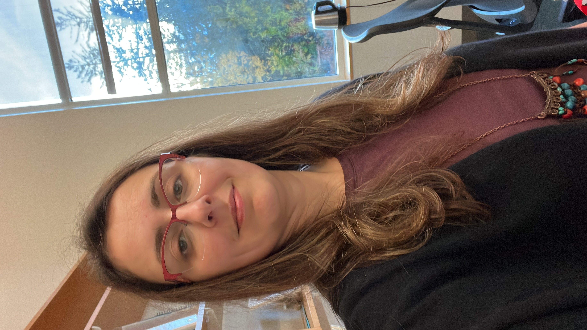

{: style="width:180px; border-radius:50%;" }
    
# Hi, I’m Burcu.

I build statistical modeling frameworks for structured, dependent systems—networks, longitudinal processes, survey/census data, and predictive systems where standard independence assumptions break.

I work at the intersection of statistics and data science, currently at the University of New Hampshire.  
🔗 [UNH profile](https://paulcollege.unh.edu/person/burcu-eke-rubini)

---

## Focus

- Modeling under dependence (relational, longitudinal, hierarchical systems)
- Missing data mechanisms & imputation systems
- Network formation / relational inference
- Predictive modeling with calibration, stability & uncertainty
- Statistical computing

---

## Leadership

- **President-Elect (2026)**, Caucus for Women in Statistics and Data Science ([CWS](https://cwstat.org/))
- **Secretary (Founding Leadership Team)**, International Turkish Statistical Association ([ITSA](https://www.itsa-tr.org/))

---

## Contact

Email: [Burcu.EkeRubini@unh.edu](mailto:Burcu.EkeRubini@unh.edu)  
LinkedIn: [burcu-eke-rubini](https://www.linkedin.com/in/burcu-eke-rubini/)  
CV: [PDF](https://universitysystemnh-my.sharepoint.com/:b:/g/personal/be1008_usnh_edu/EW3TLndu2AhGqWy6zBDxvl0BOm-OCJjG36FxoThtd4pkhw)
